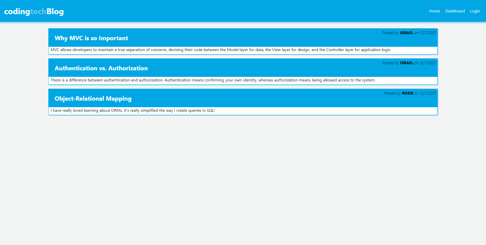
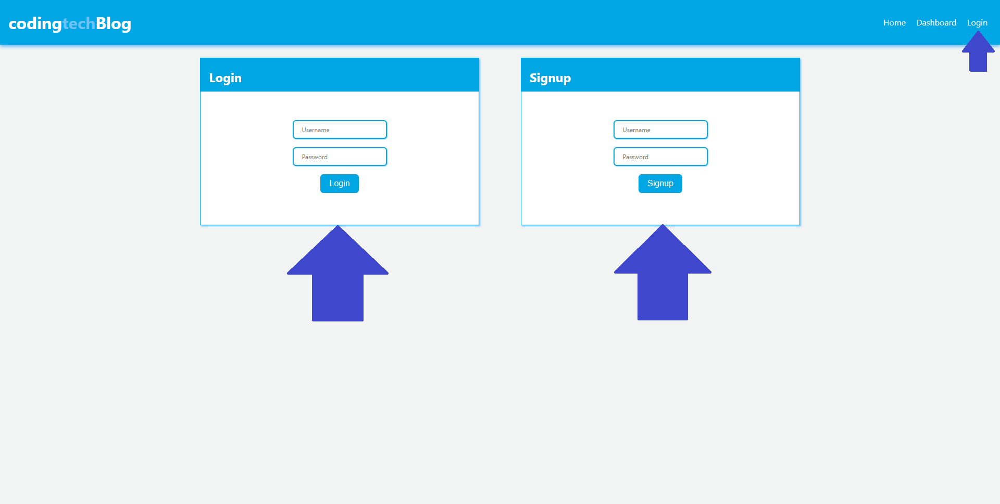
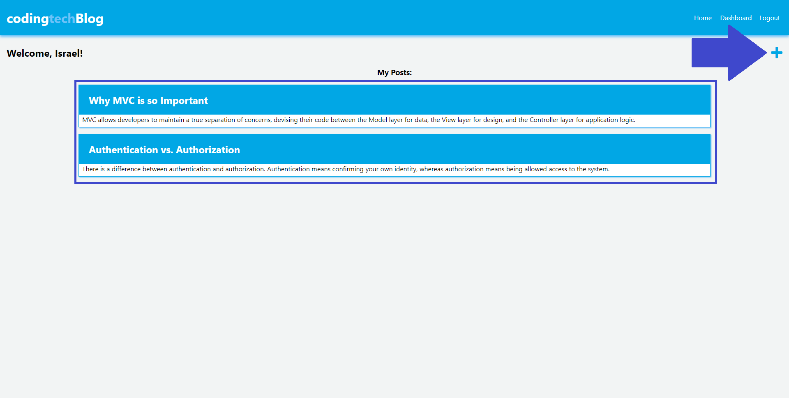

# Coding-Tech-Blog


## Description
This application is a CMS-style blog site that uses the MVC paradigm, Handlebars.js, Sequelize, and the Express-Session Package. The application can be found in [Heroku](https://agile-wildwood-77680.herokuapp.com/) but can also be cloned and run locally, see [Installation](#installation) and [Usage](#usage) for more details. This application was created so I can publish articles, blog posts, and my thoughts and opinions on the web.

This project has been the most complex we have been assigned as of yet. It took a while and many attempts to find and fix all the bugs. I was able to practice file architectural structure, fetch request, routes and handlebars. Since I ran into many issues even uploading to Heroku I was able to really dive deep into this project.

## Table of Contents
- [Installation](#installation)
- [Usage](#usage)
- [Contributing](#contributing)
- [Questions](#questions)
- [License](##license)

## Demo


## Installation

How to install this application and getting started:

* Clone the repo to your local machine
* Open the integrated terminal for the server.js file
* Run `npm install --y` which will install any dependencies
* Create a .env file on the root folder and enter your mySQL username and password
```
DB_NAME=coding_tech_db
DB_USER=" "
DB_PW=" "
```
* Open the integrated terminal for the server.js file
* Run `npm start` which will start the server
* Visit http://localhost:3001/

## Usage
You can find the deployed application by clicking on this link https://agile-wildwood-77680.herokuapp.com/.

### Step 1
> **Note**: Not all available options and steps will be demonstrated here
* After the command has been invoked or if you visit the Heroku App you will see the landing page



### Step 2
* When arriving to the app you'll be able to see the post but will not be able to comment or make your own post until you login or sign up
* Click on the upper right hand corner and enter your information to sing up or login



### Step 3
* After login in you will be directed to your Dashboard, here you will have access to create a new post by clicking the `+`
* In the center you will see cards that display all the post that were posted by the person logged in
* If `Home` button is pressed in the upper right hand corner you will be redirected to the home page with all the public posts
* If a post is clicked on you will be given the option to edit your post or delete it


> **Note**: Not all applications options are demonstrated or depicted here

## Contributing
There are many ways in which you can participate in this project, for example:

* Submit bugs and feature requests
* Review source code changes
* Review the documentation and make pull requests for anything from typos to additional and new content

## Questions
To find more information and the repository on this project please visit my [GitHub](https://github.com/israelmrios).

For any additional questions please email me [here](mailto:israelm.riosjr@gmail.com).

## License
Copyright (c) 2021 Israel M Rios.
Licensed under the [MIT License](LICENSE).